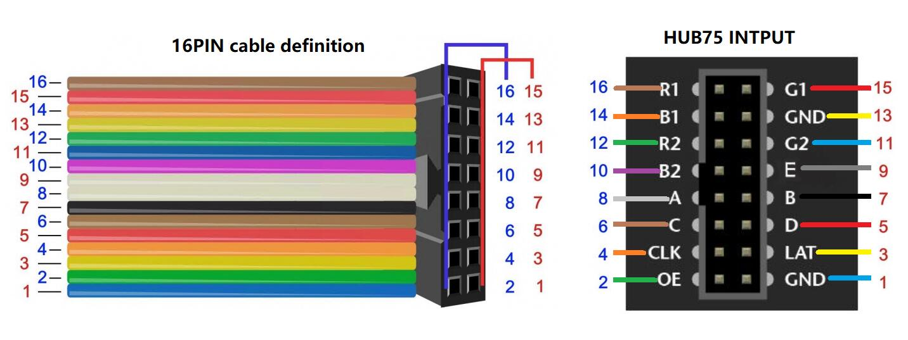

# Tidbyt-Inspired LED Matrix
Inspired by a very targeted ad promoting the [Tidbyt](https://tidbyt.com), I created my own using an LED Matrix and a Raspberry Pi Pico W.

## Supplies
- [ ] [64x32 LED Matrix](https://www.amazon.com/Full-Color-Raspberry-Displaying-Adjustable-Brightness/dp/B0B3W1PFY6?th=1)
- [ ] [Barrel Jack Connector](https://www.amazon.com/DAYKIT-Female-2-1x5-5MM-Adapter-Connector/dp/B01J1WZENK/ref=sr_1_1_sspa?crid=1MW115A6TV7YY&keywords=barrel+jack+connector&qid=1693456075&s=electronics&sprefix=barrel+jack%2Celectronics%2C117&sr=1-1-spons&sp_csd=d2lkZ2V0TmFtZT1zcF9hdGY&psc=1)
- [ ] Raspberry Pi Pico W
- [ ] Data Transfer Micro USB
- [ ] 5V Power Supply (I used 5V/2A)
- [ ] Jumper Wires

## Wiring

### Pico to LED Matrix

I strongly suggest soldering the wires directly to the Pico because it will be extremely difficult to troubleshoot wiring issues while debugging code.

Using this diagram connect the wires as follows:

| Number | Input              | Pico GPIO Pin |
|--------|--------------------|---------------|
| 1      | Ground (GND)       | GND           |
| 2      | Output Enable (OE) | GP13          |
| 3      | Latch (LAT)        | GP12          |
| 4      | Clock (CLK)        | GP10          |
| 5      | D                  | GP9           |
| 6      | C                  | GP8           |
| 7      | B                  | GP7           |
| 8      | A                  | GP6           |
| 9      | E                  | _NONE_        |
| 10     | B2                 | GP5           |
| 11     | G2                 | GP4           |
| 12     | R2                 | GP3           |
| 13     | Ground (GND)       | GND           |
| 14     | B1                 | GP2           |
| 15     | G1                 | GP1           |
| 16     | R1                 | GP0           |
You don't use the E input so I just capped off the wire.
### LED Matrix to Power Supply
Connect the power cable to a barrel jack adapter (Red to + & Black to -) and then to a power supply (or directly to the power supply if you're fancy like that).

